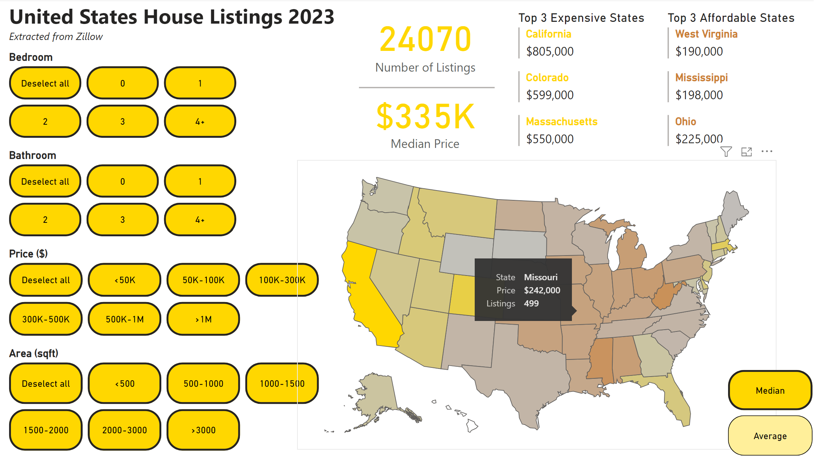
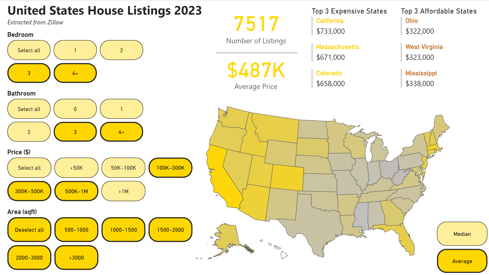

# United States House Listings Analysis

## Introduction
The year 2023 has been marked by economic instability, characterized by high inflation and interest rates, significantly impacting daily life. Given that housing constitutes the largest portion of household expenses, it is evident that these economic factors would exert a substantial influence on the housing market. As we approach the end of 2023, it is opportune to conduct a comprehensive overview of the US housing market, leveraging data from Zillow, a prominent online real estate marketplace that encompasses information on approximately 100 million homes.  

This project aims to visualize and conduct a high-level analysis of the US housing market using a dataset comprising around 25,000 listings sourced from Zillow. The dataset encompasses a diverse range of housing characteristics across different states. The initial phase involves data cleaning using Pandas in Python, followed by visualization of the dataset using Power BI. This dual approach allows for a robust examination of trends and patterns within the housing market, providing insights into the potential impact of economic conditions on the real estate landscape.

## Acknowledgement
The dataset utilized in this project has been sourced from the Kaggle dataset titled "United States House Listings: Zillow Extract 2023," generously contributed by Febin Philips. For those interested, the dataset can be accessed at the following Kaggle link: https://www.kaggle.com/datasets/febinphilips/us-house-listings-2023.  

Furthermore, it's important to note that the house listings originate from Zillow, a well-known online real estate marketplace. The Zillow platform, available at https://www.zillow.com/, serves as a comprehensive source for real estate data, playing a crucial role in this project's exploration and analysis of the US housing market.

## Snapshots

